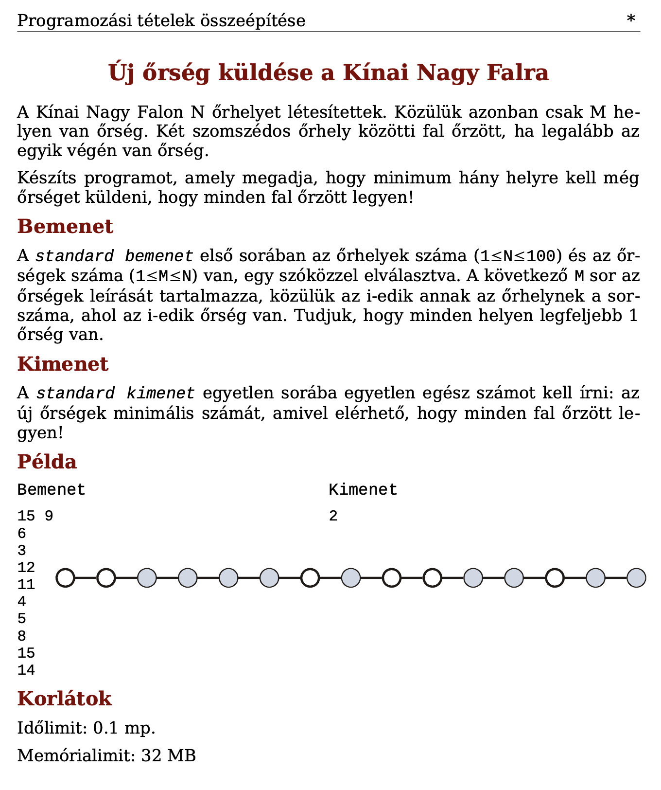
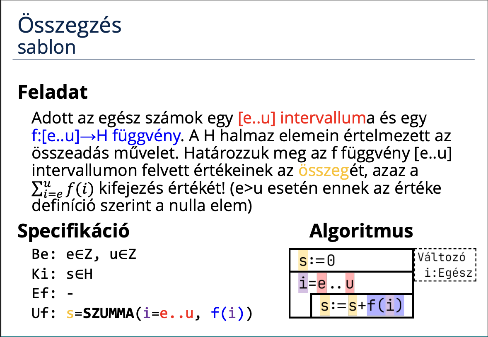
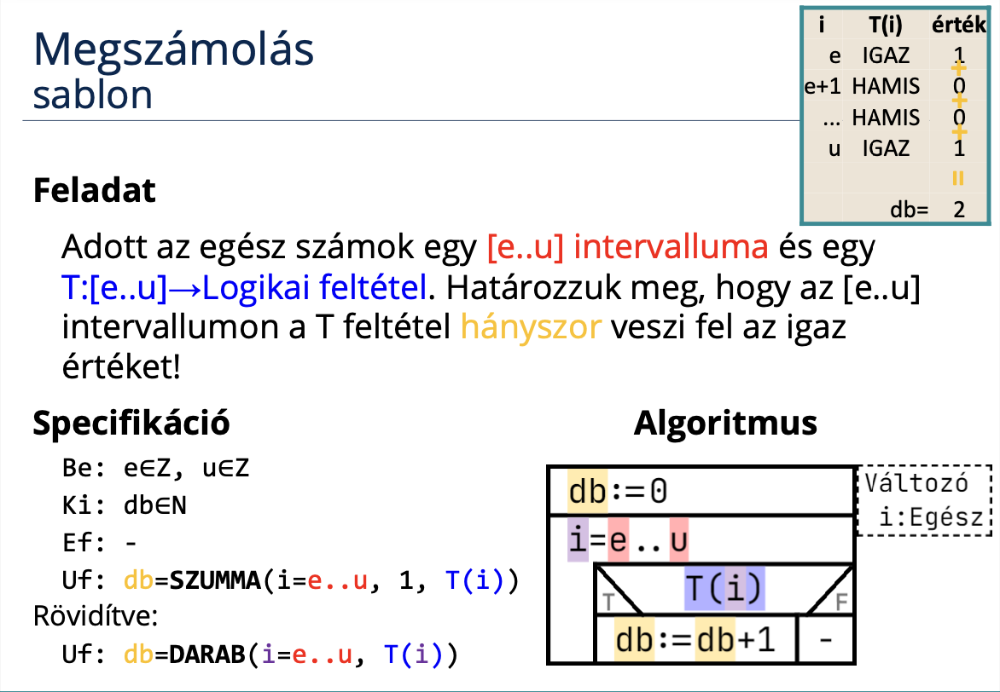

# Programozás 2. beadandó
## Új őrség küldése a Kínai Nagy Falra
### Feladat


### [Specifikáció](https://progalap.elte.hu/specifikacio/?data=H4sIAAAAAAAAE2VR206DQBD9lQlPbbKtLL1EN8WERmNMrSbW%2BiDwsBQat4XVCDyYpom%2B9Vf8jv5Jv8TZXbCoCTBnhnPOzOxurPw1WYilWPBCvEiLWeOEgTzsdrcEMhNSkRdcQZ92u1kYyBlnsOQpX9dFGRIoV394BGBdps38WXD5XhfiCCtxpNJATgRDA4MvlwxadORK2H%2FlIEcute22xqqaaZTh73Yg50g97D4ECk0P1tJz%2BXoUX4QhuEC1OJAAeiCfqmI1rUo6QI%2BE2s3RbtBSAtEUCCX4STpG3%2BgQR0i%2B8O69cUu4aiYCxuO8ydIngcTJ9eP%2B8%2Bbuynv4x65Ru%2BscdeUKRbOn%2BXTqGUEcVceKzBOn0UEiUVrEKpK8yC3mb6yYFxzvFyQDOkBSxuAMg96EgT8k0CNAHXyxd5%2FAgMApJhhoHy%2Fd3DgSbQL40MZj11%2F7d4UqWXVWKOzVtkPjTKt2fdVFUXFhpmYH36ntjBFgrqDGtqLGEQMHo96dKYFjmpkyLi55luC6iN6SvEwLi9FtuP0G%2BXr8NPACAAA%3D)

```groovy
Be: n∈N, m∈N, lista∈N[1..m]
Sa: falak∈N[1..n], ujlista∈N[1..m],  kul∈N[1..m], hiany∈N[1..db], db∈N
Ki: uj∈N
Ef: (1<=n és n<=100) és (1<=m és m<=n)
Uf: ∀i∈[1..m]:(falak[lista[i]] = 1) és
    kul[1] = ujlista[1] - 1 és
    ∀i∈[2..m]: (kul[i] = ujlista[i] - ujlista[i-1] - 1) és
    db = DARAB(i=1..m, kul[i]>1) és
    hiany = KIVÁLOGAT(i=1..m, kul[i]>1, kul[i]).2 és
    uj = SZUMMA(i=1..db, hiany[i]/2) és
    n = n
```

### Sablon





### Visszavezetés
```groovy
e..u ~ 1..m
```

### Algoritmus


### Kód (C#)
```cs

```

### Bíró pontszám


### Saját tesztfájlok