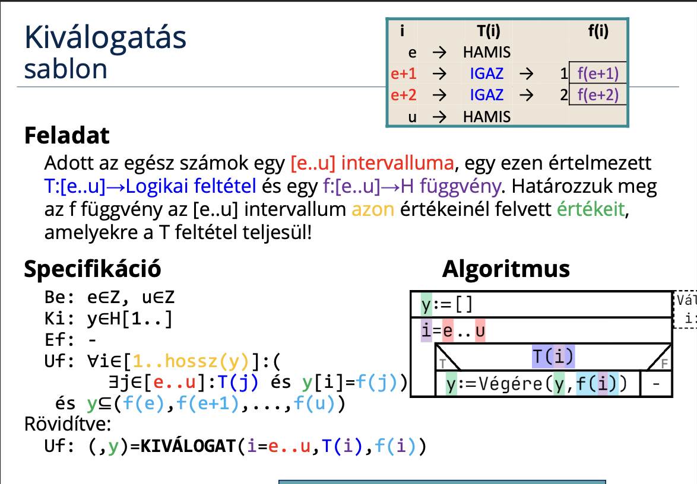
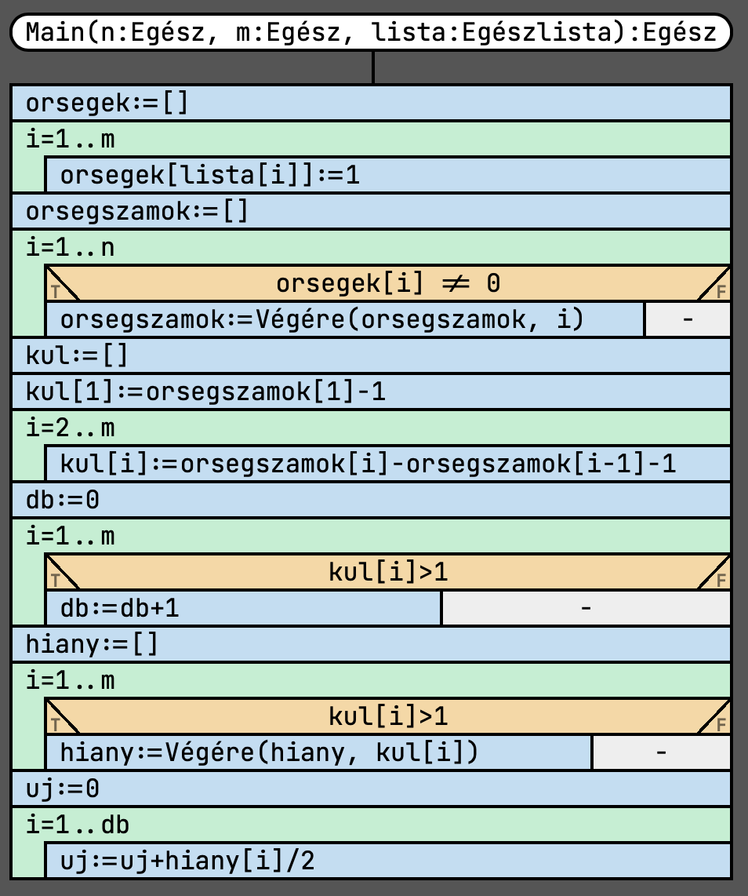

# Programozás 2. beadandó
## Új őrség küldése a Kínai Nagy Falra
### Feladat


### [Specifikáció](https://progalap.elte.hu/specifikacio/?data=H4sIAAAAAAAAE41SS07DMBS8yiMrKpkSu4WCRZCKQAjxkyiwIM0iIQHcNi4iyQIQEux6Fc7BTTgJz3bcOnwkqjR%2Bfpl5npnk2Svus2txI67jUkylx72djIP8nM1OCORmmYiijFUZ0nY7j4ZyEHOYPhTZbTa2bRkR0yqe4nw6XqAJjKuJu70TsXy0jTTBTpqo7VAeCg7VyNR7NxyW6VYg4eO9ALkVUN9v6Vp1c13l%2BLg1lBcI%2FZy9CiSaM5BZqwu19FBEEQRANX8oAX%2BOVHxyeHD58XZ0ut8%2FXxaBMkOsPaTCUgA%2BAdFqswUfPYVUDXUGqcYK0AXIimK1KEUS30lCkRqNFTPHUZsmSNrtn%2FV3jL5ch4rUbRelg%2F3FjYO2VcNLNULS4Ori%2BLhvCGlSvyVErrKWR7wyK8rC4%2BGzl8ZljB8JSA50Dfk5h01cdM4cwnUCHQKU4R8P6xJYI7CBG1xoF78cmytCMVO8qHP59u43O3RONBEhuWOHr5v5tD60q85ScPSJMGbHmUFsfoaCpAkHhqu2qsFMtauRaaNtGecZmsXqISuqSelx%2BkKaGfgmg66TAdPaegQ2fxj%2BadLR03TYnGLsUOtCJzLXbc3QWj39l%2FQNo7zjKDevrNeU%2FU3tn4IdslHra6msIbXe2%2Bh11n%2BojV6%2BAGf9qmOcBAAA)

```groovy
Be: n∈N, m∈N, lista∈N[1..m]
Sa: orsegek∈N[1..n], orsegszamok∈N[1..m], kul∈N[1..m], hiany∈N[1..db], db∈N
Ki: uj∈N
Ef: (1<=n és n<=100) és (1<=m és m<=n)
Uf: ∀i∈[1..m]: (orsegek[lista[i]] = 1) és
    orsegszamok = KIVÁLOGAT(i=1..n, orsegek[i] != 0, i).2 és
    kul[1] = orsegszamok[1] - 1 és
    ∀i∈[2..m]: (kul[i] = orsegszamok[i] - orsegszamok[i-1] - 1) és
    db = DARAB(i=1..m, kul[i]>1) és
    hiany = KIVÁLOGAT(i=1..m, kul[i]>1, kul[i]).2 és
    uj = SZUMMA(i=1..db, hiany[i]/2)
```

### Sablon




### Visszavezetés
```groovy
MÁSOL: ∀i∈[e..u]:(y[i-e+1]=f(i))
e..u     ~ 1..m
y[i-e+1] ~ falak[lista[i]]
f(i)     ~ 1

KIVÁLOGAT:
y    ~ orsegszamok
e..u ~ 1..n
T(i) ~ orsegek[i] != 0
f(i) ~ i

MÁSOL: ∀i∈[e..u]:(y[i-e+1]=f(i))
e..u     ~ 2..m
y[i-e+1] ~ kul[i]
f(i)     ~ ujlista[i] - ujlista[i-1] - 1

DARAB:
db   ~ db
e..u ~ 1..m
T(i) ~ kul[i] > 1

KIVÁLOGAT:
y    ~ hiany
e..u ~ 1..m
T(i) ~ kul[i]>1
f(i) ~ kul[i]

SZUMMA:
s    ~ uj
e..u ~ 1..db
f(i) ~ hiany[i]/2
```

### [Algoritmus](https://progalap.elte.hu/stuki/?data=H4sIAAAAAAAAE61Y23LiOBD9laynamumhmSNuQW2eEhCCGRCLhAugeLBF%2FkCxia%2BJJhUPmi%2BY35sJIHa8g6uHe3GL7Qb6ZzT3ZLc9pvkGFJDkk8URa7VZaVeqZdq1aKslKWCZPsvKOji%2F73YdQtSiFykR8ggHuniUblou0MXD%2FN8A4VS402qloal66KcEJvCgqMgrdUAeVEKZjuGgTypYapuiApSlKwRnhCi5xh5OsITdNtxDTyna2DsmYRaTrEzfvXxP5p3Fm6M7SU2%2B5FXXY3cITY5QeNTs9KyL1fYvHwenVqdTQ%2BbL%2FY4aTlhF5sP3uliMim3sHnWfU0mo8o1QehcfWupbRmbynJ1o1zYxLwMdSc23YU0fy9Ig2fXrUTLACIEBx8hr1A0zqeVXa95ZUTpAIfRccAcHZfmw3SvmINy%2BZ7hRI6PB0hOs3hyQlKk%2BUYy2OvpZmLCCkAOUwCOjAIuDTkBR2qEVng4HhGhTYRdfhAiCy1nroP%2FnDnzeaNZJJRQU0bJFVkk6DzKcKuu%2FGWjOZsTNnlaaqHBIAQ2cGTYuNUlWtFk0UIamvZpRQGH0XHAIsHlVtQ7VFGICStIJpZ21%2FfTgMGRUQCqxQPuD5ffnqbDIQ14%2FNBrX7R6z0AHjgzdXXJ7fjsyH3PpPN9fE%2FkwkOFxMz9GPggk8gEHspUCc3TcojlM55j%2FKBZb%2Fc786I%2FmETlooiBG54Hq6Xamdlx5KOSBIZACsntY8mH3MEc2Pynqf9s9ox%2FfrR%2FfA%2FSZ8xaOnC9EA5y%2FUPP0QBZZ5Ac0LGMXp6zR5FhnxfkxPTjuW5H3ELWXQAuODC33SBBdGpZ%2F87TePN3SpQE4jI4DFony8FZWcg5niAkrADlMATgyCrg0%2FK88O%2FPjzO0xSzw8WZkO7lErkokDOgyt0ZQJx7S%2F1rdX9zZwgCPDwT3ZRYurTTaGb%2BmPtLiAw%2Bg4YJGQxJ68EBNWYC6C8yu9NwYF4Mi2Gky1eMDoZRotBs9lGnAl7Ny4N0raaoAje250uuPt%2FfA8l46d0zAQDs505sfIB4G0U2I40CmlwBwdt2h%2B85zebYQ%2FrejvopR7RnOlyTujIXwsFhLPxIIjI5ZDFdovhvaVbktobRkN1%2BuKrOEDNLajeglroczapF1Ck%2Ft0pTJHtoVK22vRUqO15fidpbVroRgOtFApsEhYYlsTYsIKXnt2udo%2FS89dcGQUgGrxgG%2Bn7bs4vH6iAa8vRn5y39kAHTiy%2BR1tx%2FHjIv7XrQkDIYHpzI%2BRDwKJfMCB1Z4C86s9XTQfuTW50uRtTQgfi4XEM7HgyIjlUEX3DDRO9L5wtIuC9k3w1snIuddQkZV9gDxe7J%2BjgzPnZdOy0v4QHNkmib31ihffrz5GQSXZN0kMB5qkFFgkpNzNamiHdisEhSWAHiYBHBkJXB6EshovvtJK4iL%2BpdDTnX2pgPWefroQCTn%2FlXl38GKqEC96PfKtQF2R1L9JnroiU3uq4332Gpd4oYXbwtEKLPquvb%2Bj9pf9DeZ4UQNH1VzyKUfCt4Hv%2FyI0tP3XDlINFEgNst92nlE6kUbwPid1crFYkoKd9Jn0yTRlfGGUT%2BTXJLsZ%2B3TwaXIFLJNaNbkkq9TSkWqe1qT5LhPnqr60Aj%2F2jD2wpmgKGUZ%2BGTDSmQ%2FVdJVZJrWMsi4jhcCRb1e%2FwOn4oqz4YnCmwnzINPQ8OK4gv6CSax%2Fzb%2BGbZr2%2B%2B1eWT%2FV6hVgIobJR5TPy%2Fv4Tmz0e18MTAAA%3D)




### Kód (C#)
```cs

```

### Bíró pontszám


### Saját tesztfájlok
1.
```
10 4
2
4
7
9
```
2.
```
8 3
1
4
7
```