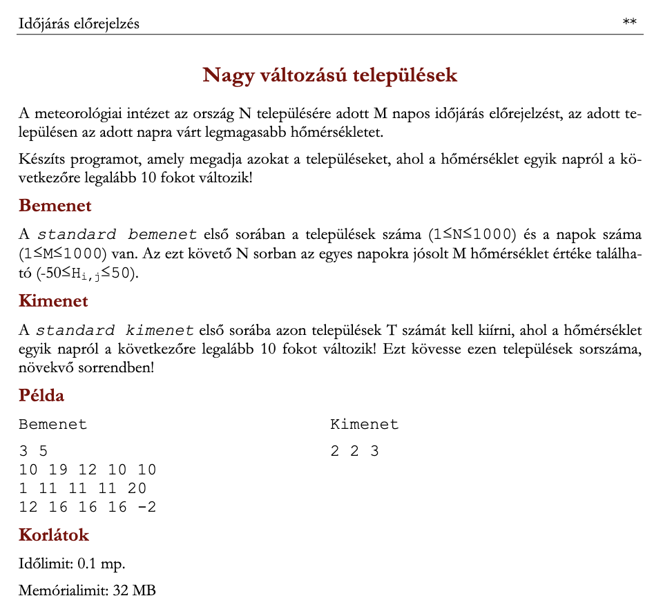
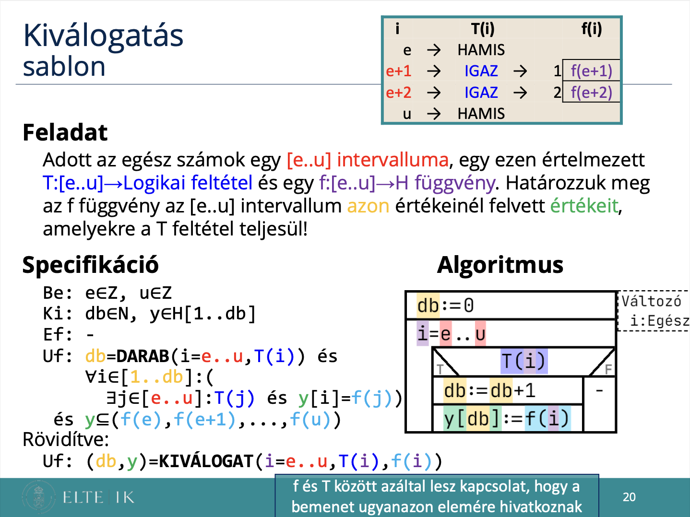
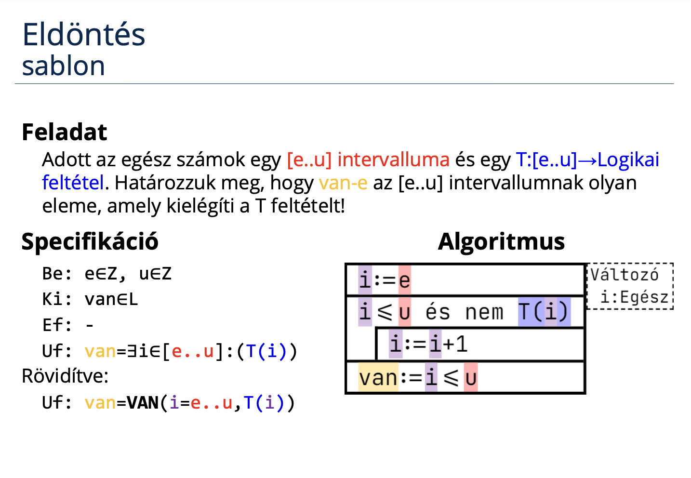
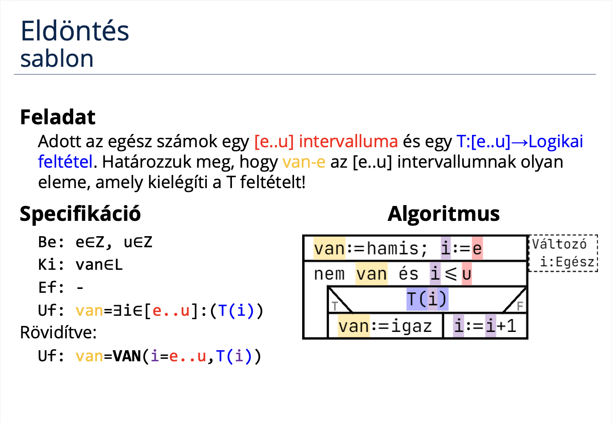
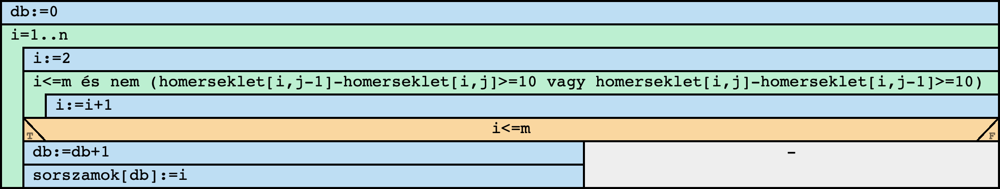

# Programozás komplex beadandó
## Nagy változású települések

### Feladat


### [Specifikáció](https://progalap.elte.hu/specifikacio/?data=H4sIAAAAAAAAE42RXU7CQBDHrzLpE02mZLftkrihJpgYYzD4ojxY%2BlBo1QK7GFpNlJDoG1fxHNyEkzgtUEqVxHa785H%2FzP5muzDSl3iUPCajMEtm2pDGRSxBb1arHoLamueZiudpPJnGGSUefN5saqRNBQPdTSREw60unc3Tj1DNJnmYq6IhKS4fJfC2p2H9nYJue5wxVviUVIWjKsnN6jOh8uKMQDYoHO9CRaElWNur4PgJjoOirp5se4KZ5kDf0%2BmNaIglmwkedK%2F766%2Bb26vOXSPximmg3%2Bk1xp5Nx2C9l8UDq97%2BnIjhLXx6%2F3VwXUrVudhESEwDjSxOs9SQ%2FsKIwiyk6wYtwRloUBIEmUq1BJ8S9PicIT9DbmPusAD3aeT7ZVeyJGvtlmXTD4D8i4YSbLLlPVB3G8EJiEmHKiYS8uZx%2BjrNDMmXeATobgFbpwAFcoG2QEegy2gvYSwitgQyFDl7hZJh%2BZY5mxU9cl2uFlV2p8ZOI6P7P3ixhXdOwjN0RRW6ICWUwxTEZNFgZI8HOKAXN3BE7P5B7JDkBHOw%2FAGmP1T9iwMAAA%3D%3D)
```groovy
Be: n∈N, m∈N, homerseklet∈Z[1..n,1..m]
Ki: db∈N, sorszamok∈N[1..db]
Ef: 1<=n és n<=1000 és 1<=m és m<=1000 és ∀i∈[1..n]:(∀j∈[1..m]:(-50<=homerseklet[i,j] és homerseklet[i,j]<=50))
Uf: (db,sorszamok) = KIVÁLOGAT(i=1..n, VAN(j=2..m, homerseklet[i,j-1]-homerseklet[i,j]>=10 vagy homerseklet[i,j]-homerseklet[i,j-1]>=10), i)
```

### Sablon




### Visszavezetés
```groovy
KIVÁLOGAT:
db   ~ db
y    ~ sorszamok
e..u ~ 1..n
T(i) ~ VAN(j=2..m, homerseklet[i,j-1]-homerseklet[i,j]>=10 vagy homerseklet[i,j]-homerseklet[i,j-1]>=10)
f(i) ~ i

VAN:
e..u ~ 2..m
T(i) ~ homerseklet[i,j-1]-homerseklet[i,j]>=10 vagy homerseklet[i,j]-homerseklet[i,j-1]>=10
```

### [Algoritmus](https://progalap.elte.hu/stuki/?data=H4sIAAAAAAAAE61W627aMBh9FeRK1abRygTKbeJHadeWbrRV0wsU8cOxHZISHJYEaKl4oD3HXmyfU2xMC1qjLX8wx5%2FPOd8llxfkM1RHeL9cKmOrWqlVqriMMT5AeeSFUx61YFtMgiCPYh5wmnAmETS2up5ld%2BYQJkLGY1R%2FQdfVy%2BN27cmW65RVA3k0JhEXyYrM8xnjAtVdEsQ8j5LnMYcDMf854YJyOEA9P2BwpsWAu4eO7eOTm%2FvODez4R9%2BuaKf2HfUX%2BRWuNI3AlabpZItyQhI%2BgnCISPhTAhBz6g2MQMO%2BuqvNDpunWkMDaxraV%2FbsHg%2BvrKOWfQ075%2Fim%2BxAUS7C8nXmJmIOiTFSzKxOGXJZEZ6CcOggF8xM%2FFJKqUdjfFwA6IXu2ly5ba5mCA21SOTBcGw6M4ny41H69YUmJ4unUi%2B%2F8ppbQwJqEUaOslT67PA0GHechranmUXIGcZaMNtZ0N0i%2BNka537%2FinOCj3CcvHPEo5sOAJz0%2F%2F7hX6O%2B9gfq7AzhSwLkpGTzn3m6%2BjQaCZfznTZ3TlYM8ddIqTw2s5WkUO0vn%2FC8FKTK%2BbdliXLjXIhpYE7kYVtvNCT3aKiLCcCz5dKDiM04afPomyT4LPx4v7GrxMh0u9TiTYxGV5s2ToP2klTWwptxl5w%2Bd7pD8NRMdqPiMk%2F8nE21Q2tc8Ss4gzjLVvrt5pGXzowlvRkRQb23mjA6lVBtCdOpgVNdfGTUbkmFitjy7mbMcTNVbPZird9c%2FysRhFM%2FJKBz2mNOHOwEtQC%2BG6tAkHERkJJvzggQZyfNt4stn7JREPnEC%2BcpE8DcKw3dP7tgLZ3ersKUNiZ5xwni0hBZ92Z8APMjUXi310I7rwvsbA82O%2FHVlFwGjGnPwgV656aqCi5ikK8qJW62g%2FmuGTUKHgyicCLYkdizHkmHyVxFzqjBeoUSt3HTFShRzS9LJj4R3dBSuVBUuRedaCuMuo9vojBq%2FY5XXMucP8bturfa6i3GV1uSXzw7nvMTKZkUWiz%2BSqNkkKwkAAA%3D%3D)


### Kód (C#)

### Bíró pontszám

### Saját tesztesetek
1.
```
4 6
5 15 25 35 40 35
-10 -5 0 5 10 20
0 0 0 0 0 0
20 25 30 20 10 5
```
2.
```
5 3
50 45 35
10 20 25
-30 -40 -30
0 0 0
25 15 5
```
