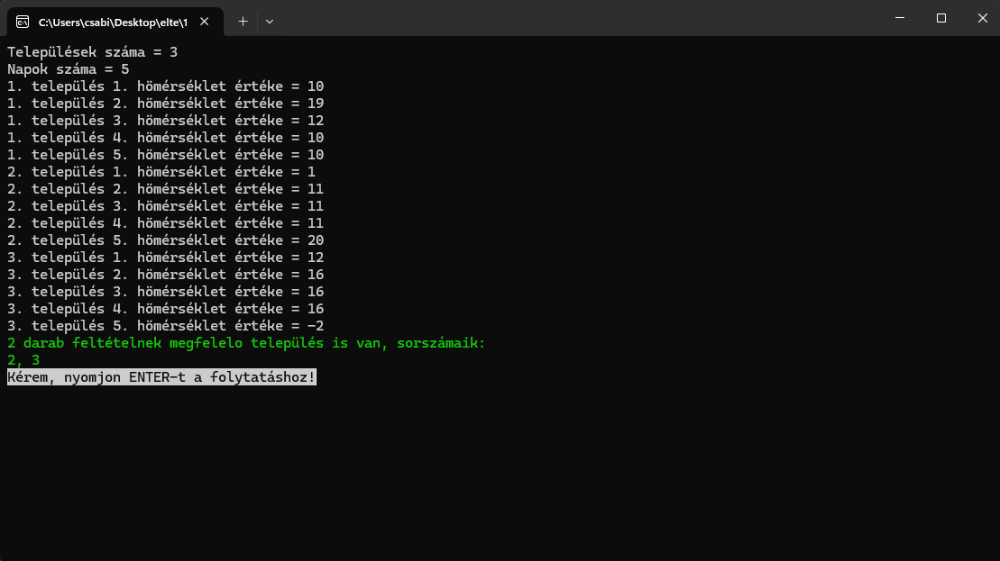
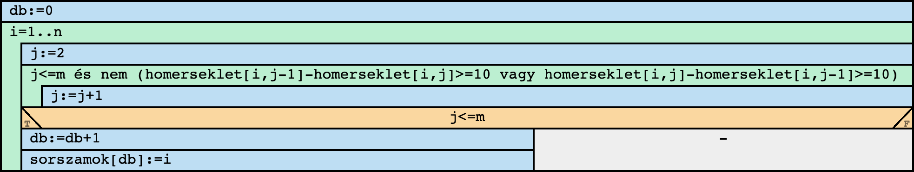
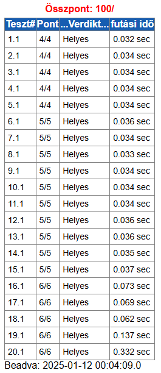

# Komplex beadandó feladat

## Tartalomjegyzék
- [Felhasználói dokumentáció](#felhasználói-dokumentáció)
    - [Feladat](#feladat)
    - [Futási környezet](#futási-környezet)
    - [Használat](#használat)
        - [A program indítása](#a-program-indítása)
        - [A program használata billentyűzetről való bevitel esetén](#a-program-használata-billentyűzetről-való-bevitel-esetén)
        - [A program használata fájlból való bevitel esetén](#a-program-használata-fájlból-való-bevitel-esetén)
        - [A program kimenete](#a-program-kimenete)
        - [Minta bemenet és kimenet](#minta-bement-es-kimenet)
        - [Hibalehetőségek](#hibalehetőségek)
- [Fejlesztői dokumentáció](#feljesztői-dokumentáció)
    - [Feladat](#feladat)
    - [Tervezés](#tervezés)
        - [Specifikáció](#specifikáció)
        - [Visszavezetés](#visszavezetés)
        - [Algritmus](#algoritmus)
    - [Fejlesztői környezet](#fejlesztői-környezet)
    - [Forráskód](#forráskód)
    - [Megoldás](#megoldás)
        - [Függvénystruktúra](#függvénystruktúra)
        - [A kód](#a-kód)
        - [A kód (magas szintű függvényekkel)](#a-kód-magas-szintű-függvényekkel)
    - [Tesztelés](#tesztelés)
        - [Automatikus tesztek (Bíró)](#automatikus-tesztek-bíró)
        - [Automatikus tesztek (Bíró, magas szintű függvényekkel)](#automatikus-tesztek-bíró-magas-szintű-függvényekkel)
        - [Érvényes tesztesetek](#érvényes-tesztesetek)
        - [Érvénytelen tesztesetek](#érvénytelen-tesztesetek)
    - [Fejlesztési lehetőségek](#fejlesztési-lehetőségek)


## Felhasználói dokumentáció
### Feladat
**Nagy változású települések**
A meteorológiai intézet az ország N településére adott M napos időjárás előrejelzést, az adott településen az adott napra várt legmagasabb hőmérsékletet.  
Készíts programot, amely megadja azokat a településeket, ahol a hőmérséklet egyik napról a következőre legalább 10 fokot változik!

### Futási környezet

### Használat
#### *A program indítása*
A program az A1B2C3\bin\Release\A1B2C3.exe néven található a tömörített állományban.

#### *A program használata billentyűzetről való bevitel esetén*
Az A1B2C3.exe fájl elindításával a program az adatokat a billentyűzetről olvassa be a következő sorrendben:

|#|Adat|Magyarázat|
|-|----|----------|
|**1.**|Települések száma (N)| 1≤N≤1000|
|**2.**|Napok száma (M)|1≤M≤1000 |
|**3.**|1. településen az 1. napon jósolt hőmérséklet|-50≤H<sub>i,j</sub>≤50 innentől|
|**4.**|1. településen a 2. napon jósolt hőmérséklet|
|...|...||
||1. településen az m. napon jósolt hőmérséklet||
||2. településen az 1. napon jósolt hőmérséklet||
||...||
||n. településen az m. napon jósolt hőmérséklet||

#### *A program használata fájlból való bevitel esetén*
Lehetőségünk van az adatokat **fájl**ban is megadni. Ekkor a programot parancssorban a következőképpen kell indítani, feltételezve, hogy a bemeneti fájlok mellette helyezkednek el:
```A1B2C3.exe < be1.txt```
A fájl felépítésének a következő formai követelményei vannak. A standard bemenet első sorában a települések száma (N) és a napok száma (M) van. Az ezt követő N sorban az egyes napokra jósolt M hőmérséklet értéke található. Például:
```
3 5
10 19 12 10 10
1 11 11 11 20
12 16 16 16 -2
```

#### *A program kimenete*
A program kiírja azon települések T számát kell kiírni, ahol a hőmérséklet egyik napról a következőre legalább 10 fokot változik. Ezt követi ezen települések sorszáma.

#### *Minta bemenet és kimenet*


#### *Hibalehetőségek*

##### *Mintafutás hibás bemeneti adatok esetén:*
 

## Fejlesztői dokumentáció
### Feladat
**Nagy változású települések**
A meteorológiai intézet az ország N településére adott M napos időjárás előrejelzést, az adott településen az adott napra várt legmagasabb hőmérsékletet.  
Készíts programot, amely megadja azokat a településeket, ahol a hőmérséklet egyik napról a következőre legalább 10 fokot változik!

### Tervezés
#### [*Specifikáció*]()
```groovy
Be: n∈N, m∈N, homerseklet∈Z[1..n,1..m]
Ki: db∈N, sorszamok∈N[1..db]
Ef: 1<=n és n<=1000 és 1<=m és m<=1000 és ∀i∈[1..n]:(∀j∈[1..m]:(-50<=homerseklet[i,j] és homerseklet[i,j]<=50))
Uf: (db,sorszamok) = KIVÁLOGAT(i=1..n, VAN(j=2..m, homerseklet[i,j-1]-homerseklet[i,j]>=10 vagy homerseklet[i,j]-homerseklet[i,j-1]>=10), i)
```

#### Visszavezetés
```groovy
KIVÁLOGAT:
db   ~ db
y    ~ sorszamok
e..u ~ 1..n
T(i) ~ VAN(j=2..m, homerseklet[i,j-1]-homerseklet[i,j]>=10 vagy homerseklet[i,j]-homerseklet[i,j-1]>=10)
f(i) ~ i

VAN:
e..u ~ 2..m
T(i) ~ homerseklet[i,j-1]-homerseklet[i,j]>=10 vagy homerseklet[i,j]-homerseklet[i,j-1]>=10
```

#### [*Algoritmus*]()


### Fejlesztői környezet

### Forráskód
A teljes fejlesztői anyag –kicsomagolás után– az A1B2C3 nevű könyvtárban található meg. A fejlesztés során használt könyvtár-struktúra:
|Állomány|Magyarázat|
|--------|----------|
|`A1B2C3\bin\Release\netcoreapp3.1\A1B2C3.exe`|futtatható kód (a futtatáshoz szükségesfájlokkal)|
|`A1B2C3\obj\`|mappa fordításhoz szükséges kódokkal|
|||
|`A1B2C3\Program.cs`|C# forráskód|
|||
|`A1B2C3\teszt1.txt`|teszt-bemeneti fájl<sub>1</sub>|
|`A1B2C3\teszt2.txt`|teszt-bemeneti fájl<sub>2</sub>|
|`A1B2C3\teszt3.txt`|teszt-bemeneti fájl<sub>3</sub>|
|`A1B2C3\teszt4.txt`|teszt-bemeneti fájl<sub>4</sub>|
|`A1B2C3\teszt5.txt`|teszt-bemeneti fájl<sub>5</sub>|
|||
|`A1B2C3\doksi\A1B2C3.docx`|dokumentációk (ez a fájl)|

### Megoldás
#### *Függvéynstruktúra*


#### *A kód*
A `Program.cs` fájl tartalma:
```cs
using System;
using System.Collections.Generic;
namespace nagy_valtozasu_telepulesek
{
    class Program
    {
        static void Main(string[] args)
        {
            string[] sortomb = Console.ReadLine().Split(' ');
            int n = int.Parse(sortomb[0]);
            int m = int.Parse(sortomb[1]);
            int[,] homerseklet = new int[n,m];

            for (int i = 0; i < n; i++)
            {
                sortomb = Console.ReadLine().Split(' ');
                for (int j = 0; j < m; j++)
                {
                    homerseklet[i, j] = int.Parse(sortomb[j]);
                }
            }
            int db=0;
            List<int> sorszamok = new List<int>();
            for (int i = 0; i < n; i++)
            {
                int j = 1;
                while (j<m && !(homerseklet[i, j - 1] - homerseklet[i,j]>=10 || homerseklet[i, j] - homerseklet[i,j-1]>=10))
                {
                    j += 1;
                }
                if (j<m)
                {
                    db += 1;
                    sorszamok.Add(i+1);
                }
            }
            Console.Write($"{db} ");
            Console.Write(String.Join(' ', sorszamok));
        }
    }
}
```

#### *A kód (magas szintű függvényekkel)*
A `Program.cs` fájl tartalma:
```cs
```

### Tesztelés
#### *Automatikus tesztek (Bíró)*


#### *Automatikus tesztek (Bíró, magas szintű függvényekkel)*

#### *Érvényes tesztesetek*
##### 1. teszteset: `be1.txt`
|**Bemenet** - |
|--------------|
|``|
|**Kimenet**|
|``|

##### 2. teszteset: `be1.txt`
|**Bemenet** - |
|--------------|
|``|
|**Kimenet**|
|``|

##### 3. teszteset: `be1.txt`
|**Bemenet** - |
|--------------|
|``|
|**Kimenet**|
|``|

##### 4. teszteset: `be1.txt`
|**Bemenet** - |
|--------------|
|``|
|**Kimenet**|
|``|

##### 5. teszteset: `be1.txt`
|**Bemenet** - |
|--------------|
|``|
|**Kimenet**|
|``|

#### *Érvénytelen tesztesetek*
Billentyűzetes bevitel esetén
##### 6. teszteset: `be1.txt`
|**Bemenet** - *szöveges adat*|
|--------------|
|``|
|**Kimenet**|
|``|

##### 7. teszteset: `be1.txt`
|**Bemenet** - |
|--------------|
|``|
|**Kimenet**|
|``|

### Fejlesztési lehetőségek
1. Többszöri futtatás megszervezése
2. Települések nevének megadása
3. Grafikus visszajelzés a számolás lépéseiről