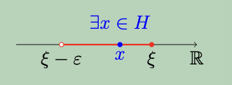
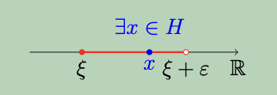

## 1. Mit mond ki a Dedekind-axióma vagy szétválasztási axióma?

**Teljességi axióma** (**Dedekind-axióma** vagy **szétválasztási axióma**):  
Tegyük fel, hogy az $A, B \subset \mathbb{R}$ halmazokra a következők teljesülnek:
- $A \neq \emptyset$ és $B \neq \emptyset$,
- minden $a \in A$ és minden $b \in B$ elemre $a \leq b$

Ekkor 

$$\exists ξ \in \mathbb{R} : \forall a \in A \quad \text{és} \quad b \in B \quad \text{esetén} \quad a \leq ξ \leq b$$

---

## 2. Írja le pozitív formában azt, hogy egy $\emptyset = A \subset \mathbb{R}$ halmaz felülről nem korlátos!

Ha a $\emptyset \neq H \subset \mathbb{R}$ halmaz felülről nem korlátos, akkor azt mondjuk, hogy a **szupréruma plusz végtelen**, és ezt úgy jelöljük, hogy $$\sup H := +\infty$$

---

## 3. Fogalmazza meg egyenlőtlenségekkel azt a tényt, hogy egy $\emptyset \neq A \subset \mathbb{R}$ halmaz korlátos!

Korlátos, ha alulról is, felülről is korlátos, azaz $\exists K \in \mathbb{R}$, hogy $\forall x \in H$ esetén $\left| x \right| \leq K$

---

## 4. Fogalmazza meg a szuprémum elvet!
**Tétel**
Legyen $H \subset \mathbb{R}$ és tegyük fel, hogy

i) $H \neq \emptyset$

ii) $H$ felülről korlátos

Ekkor
$$\exists \min \left\lbrace K \in \mathbb{R} \mid K \; \text{felső korlátja} \; H\text{-nak} \right\rbrace$$

---

## 5. Mi a szuprémum definíciója?

A felülről korlátos $\emptyset \neq H \subset \mathbb{R}$ számhalmaz felső korlátját $H$ **szuprérumának** nevezzük, és a $\sup H$ szimbólummal jelöljük.

---

## 6. Fogalmazza meg egyenlőtlenségekkel azt a tényt, hogy $ξ = \sup H \in \mathbb{R}$!

Legyen $\emptyset = H \subset \mathbb{R}$ felülről korlátos halmaz. Ekkor

$ξ = \sup H \iff$

i) $ξ$ felső korlát, azaz

$$\forall x \in H : x \leq ξ$$

ii) ξ a legkisebb felső korlát, azaz

$$\forall \epsilon > 0\text{-hoz} \; \exists x \in H : x < ξ + \epsilon$$

---

## 7. Mi az infium definíciója?

Az alulról korlátos $\emptyset \neq H \subset \mathbb{R}$ számhalmaz legnagyobb alsó korlátját $H$ **infiumának** nevezzük, es az $\inf H$ szimbólummal jelöljük.

---

## 8. Fogalmazza meg egyenlőtlenségekkel azt a tényt, hogy $ξ = \inf H \in \mathbb{R}$ !

Legyen $\emptyset \neq H \subset \mathbb{R}$ alulról korlátos halmaz. Ekkor

$ξ = \inf H \iff$

i) ξ alsó korlát, azaz

$$\forall x \in H : ξ \leq x$$

ii) ξ a legnagyobb alsó korlát, azaz

$$\forall \epsilon > 0\text{-hoz} \; \exists x \in H : x < ξ + \epsilon$$

---

## 9. Mi a kapcsolat egy halmaz maximuma és a szuprémuma között?

$$\exists \max H \iff \sup H \in H \quad \text{és ekkor} \quad \sup H = \max H$$

---

## 10. Mi a kapcsolat egy halmaz minimuma és az inmuma között?

$$\exists \min H \iff \inf H \in H \quad \text{és ekkor} \quad \inf H = \min H$$

