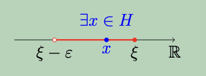
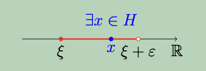

# Saját kidolgozás

### 1. Mit mond ki a Dedekind-axióma vagy szétválasztási axióma?

**Teljességi axióma** (**Dedekind-axióma** vagy **szétválasztási axióma**):  
Tegyük fel, hogy az $A, B \subset \mathbb{R}$ halmazokra a következők teljesülnek:
- $A \neq \emptyset$ és $B \neq \emptyset$,
- minden $a \in A$ és minden $b \in B$ elemre $a \leq b$

Ekkor 
$$\exists ξ \in \mathbb{R} : \forall a \in A \; és \; b \in B \; esetén \; a \leq ξ \leq b$$

---

### 2. Írja le pozitív formában azt, hogy egy $\emptyset = A \subset R$ halmaz felülről nem korlátos!

Ha a $\emptyset \neq H \subset \mathbb{R}$ halmaz felülről nem korlátos, akkor azt mondjuk, hogy a **szupréruma plusz végtelen**, és ezt úgy jelöljük, hogy $$\sup H := +\infty$$

---

### 3. Fogalmazza meg egyenlőtlenségekkel azt a tényt, hogy egy $\emptyset \neq A \subset R$ halmaz korlátos!

Korlátos, ha alulról is, felülről is korlátos, azaz $\exists K \in \mathbb{R}$, hogy $\forall x \in H$ esetén $\left| x \right| \leq K$

---

### 4. Fogalmazza meg a szuprémum elvet!
**Tétel**
Legyen $H \subset \mathbb{R}$ és tegyük fel, hogy

i) $H \neq \emptyset$

ii) $H$ felülről korlátos

Ekkor
$$\exists \min \left\lbrace K \in \mathbb{R} \mid K \; \text{felső korlátja} \; H\text{-nak} \right\rbrace$$

---

### 5. Mi a szuprémum definíciója?

A felülről korlátos $\emptyset \neq H \subset \mathbb{R}$ számhalmaz felső korlátját $H$ **szuprérumának** nevezzük, és a $\sup H$ szimbólummal jelöljük.

---

### 6. Fogalmazza meg egyenlőtlenségekkel azt a tényt, hogy $ξ = \sup H \in \mathbb{R}$!

Legyen $\emptyset = H \subset \mathbb{R}$ felülről korlátos halmaz. Ekkor

$ξ = \sup H \iff$

i) $ξ$ felső korlát, azaz

$$\forall x \in H : x \leq ξ$$

ii) ξ a legkisebb felső korlát, azaz

$$\forall \epsilon > 0\text{-hoz} \; \exists x \in H : x < ξ + \epsilon$$

---

### 7. Mi az infium definíciója?

Az alulról korlátos $\emptyset \neq H \subset \mathbb{R}$ számhalmaz legnagyobb alsó korlátját $H$ **infiumának** nevezzük, es az $\inf H$ szimbólummal jelöljük.

---

### 8. Fogalmazza meg egyenlőtlenségekkel azt a tényt, hogy $ξ = \inf H \in \mathbb{R}$ !

Legyen $\emptyset \neq H \subset \mathbb{R}$ alulról korlátos halmaz. Ekkor

$ξ = \inf H \iff$

i) ξ alsó korlát, azaz
$$\forall x \in H : ξ \leq x$$

ii) ξ a legnagyobb alsó korlát, azaz
$$\forall \epsilon > 0\text{-hoz} \; \exists x \in H : x < ξ + \epsilon$$

---

### 9. Mi a kapcsolat egy halmaz maximuma és a szuprémuma között?

$$\exists \max H \iff \sup H \in H \text{és ekkor} \; \sup H = \max H$$

---

### 10. Mi a kapcsolat egy halmaz minimuma és az inmuma között?

$$\exists \min H \iff \inf H \in H \text{és ekkor} \; \inf H = \min H$$

--- 

# ChatGPT

### 1. Mit mond ki a Dedekind-axióma vagy szétválasztási axióma?

A **Dedekind-axióma** (vagy **szétválasztási axióma**) a valós számok egy alapvető tulajdonságát fejezi ki, és biztosítja a számhalmaz folytonosságát.  

**Megfogalmazás:**  
Ha a valós számok halmazát, $\mathbb{R}$-t két nem üres részhalmazra, $A$-ra és $B$-re osztjuk úgy, hogy minden $a \in A$ és $b \in B$ esetén teljesül $a \leq b$, akkor létezik egy olyan $c \in \mathbb{R}$ szám, amely vagy $A$-hoz vagy $B$-hez tartozik, és amely a két halmaz között határt képez.  

Ez az axióma biztosítja, hogy $\mathbb{R}$ nem tartalmaz "hézagokat", tehát a valós számok halmaza **folytonos**.

---

### 2. Írja le pozitív formában azt, hogy egy ∅̸= A⊂R halmaz felülről nem korlátos!

Egy nem üres $A \subset \mathbb{R}$ halmaz **felülről nem korlátos**, ha nem létezik olyan felső korlátja, amelynél minden eleme kisebb vagy egyenlő lenne.  

**Egyenlőtlenségekkel megfogalmazva:**  
Azt mondjuk, hogy $A$ **felülről nem korlátos**, ha minden $M \in \mathbb{R}$ számra létezik egy $a \in A$ elem úgy, hogy:  

\[
a > M.
\]  

Vagyis bármilyen nagy számot választunk, mindig találunk a halmazban egy annál nagyobb elemet.

---

### 3. Fogalmazza meg egyenlőtlenségekkel azt a tényt, hogy egy ∅̸= A⊂R halmaz korlátos!

Egy nem üres $A \subset \mathbb{R}$ halmaz **korlátos**, ha létezik olyan valós szám, amely minden $A$-beli elemet felülről és alulról is korlátoz.  

**Egyenlőtlenségekkel megfogalmazva:**  
A halmaz **korlátos felülről és alulról is**, ha létezik olyan $m, M \in \mathbb{R}$, hogy minden $a \in A$ esetén:  

$
m \leq a \leq M.
$  

Azaz **$A$ korlátos**, ha létezik egy olyan intervallum $[m, M]$, amely tartalmazza az összes elemét.

---

### 4. Fogalmazza meg a szuprémum elvet!

A **szuprémum elv** a valós számok halmazában lévő korlátos felülről rendezett halmazok legnagyobb felső korlátjának létezését garantálja.  

**Megfogalmazás:**  
Ha $A \subset \mathbb{R}$ egy nem üres, felülről korlátos halmaz, akkor létezik egy legkisebb valós szám, amely minden $A$-beli elemnél nagyobb vagy egyenlő. Ezt a számot **szuprémumnak** nevezzük, és jelöljük:  

$
\sup A.
$

Ez azt jelenti, hogy ha $M$ bármely olyan szám, amely minden $A$-beli elemnél nagyobb vagy egyenlő, akkor teljesül, hogy:

$
\sup A \leq M.
$

A szuprémum tehát a halmaz **legkisebb felső korlátja**.

---

### 5. Mi a szuprémum definíciója?

A **szuprémum** (vagy **legnagyobb felső korlát**) egy halmaz számára a legkisebb olyan valós szám, amely minden halmazbeli elemnél nagyobb vagy egyenlő.  

**Formálisan:**  
Legyen $A \subset \mathbb{R}$ egy nem üres, felülről korlátos halmaz. A **szuprémum** (jelölve $\sup A$) az a valós szám, amely minden $a \in A$ elemnél nagyobb vagy egyenlő, és ha létezik bármely más $M$ szám, amely szintén minden $A$-beli elemnél nagyobb vagy egyenlő, akkor teljesül, hogy:

$$
\sup A \leq M.
$$

Ezáltal a szuprémum a halmaz **legkisebb felső korlátja**.

---

### 6. Fogalmazza meg egyenlőtlenségekkel azt a tényt, hogy ξ = sup H ∈R!

Legyen $H \subset \mathbb{R}$ egy nem üres, felülről korlátos halmaz. Ha $\xi = \sup H$, akkor a következő két tulajdonság teljesül:

1. **Felülről korlátozott**: Minden $h \in H$ elemre teljesül, hogy:

$$
h \leq \xi.
$$

2. **Legkisebb felső korlát**: Ha bármely $M \in \mathbb{R}$ szám, amely minden $h \in H$ elemnél nagyobb vagy egyenlő, akkor teljesül, hogy:

$$
\xi \leq M.
$$

Ez azt jelenti, hogy $\xi$ a halmaz **legkisebb felső korlátja**, vagyis a legkisebb olyan szám, amely minden $H$-beli elemnél nagyobb vagy egyenlő.

---

### 7. Mi az inmum definíciója?

Az **inmum** (vagy **legkisebb alsó korlát**) egy halmaz számára a legnagyobb olyan valós szám, amely minden halmazbeli elemnél kisebb vagy egyenlő.  

**Formálisan:**  
Legyen $A \subset \mathbb{R}$ egy nem üres, alulról korlátos halmaz. Az **inmum** (jelölve $\inf A$) az a valós szám, amely minden $a \in A$ elemnél kisebb vagy egyenlő, és ha létezik bármely más $m \in \mathbb{R}$ szám, amely szintén minden $A$-beli elemnél kisebb vagy egyenlő, akkor teljesül, hogy:

$$
m \leq \inf A.
$$

Ezáltal az inmum a halmaz **legnagyobb alsó korlátja**.

---

### 8. Fogalmazza meg egyenlőtlenségekkel azt a tényt, hogy ξ = inf H ∈R!

Legyen $H \subset \mathbb{R}$ egy nem üres, alulról korlátos halmaz. Ha $\xi = \inf H$, akkor a következő két tulajdonság teljesül:

1. **Alulról korlátozott**: Minden $h \in H$ elemre teljesül, hogy:

$$
\xi \leq h.
$$

2. **Legnagyobb alsó korlát**: Ha bármely $m \in \mathbb{R}$ szám, amely minden $h \in H$ elemnél kisebb vagy egyenlő, akkor teljesül, hogy:

$$
m \geq \xi.
$$

Ez azt jelenti, hogy $\xi$ a halmaz **legnagyobb alsó korlátja**, vagyis a legnagyobb olyan szám, amely minden $H$-beli elemnél kisebb vagy egyenlő.

---

### 9. Mi a kapcsolat egy halmaz maximuma és a szuprémuma között?

A **maximális elem** és a **szuprémum** közötti kapcsolat a következő:

- Ha egy halmaznak van **maximuma**, akkor annak a maximuma **egyenlő a szuprémumával**.
  
- **Maximum**: Egy halmaz **maximumának** nevezünk egy olyan elemet, amely a halmaz legnagyobb eleme, azaz létezik $x \in A$ olyan, hogy minden $a \in A$ esetén $a \leq x$. Ez az elem **része** a halmaznak.

- **Szuprémum**: A **szuprémum** a halmaz legkisebb felső korlátja, de nem szükséges, hogy az eleme legyen a halmaznak. Ha létezik maximum, akkor a maximum a szuprémum is egyben.

**Kapcsolat**:  
Ha $A$ halmaznak van maximuma, akkor az **maximum** és a **szuprémum** egy és ugyanaz, azaz:

$$
\sup A = \max A.
$$

Ha viszont nincs maximuma, akkor a szuprémum nem feltétlenül eleme a halmaznak, de még mindig a halmaz legkisebb felső korlátjaként funkcionál.

---

### 10. Mi a kapcsolat egy halmaz minimuma és az inmuma között?

A **minimum** és az **inmum** közötti kapcsolat a következő:

- Ha egy halmaznak van **minimuma**, akkor annak a minimuma **egyenlő az inmumával**.

- **Minimum**: Egy halmaz **minimumának** nevezünk egy olyan elemet, amely a halmaz legkisebb eleme, azaz létezik $x \in A$ olyan, hogy minden $a \in A$ esetén $x \leq a$. Ez az elem **része** a halmaznak.

- **Inmum**: Az **inmum** a halmaz legnagyobb alsó korlátja, de nem szükséges, hogy az eleme legyen a halmaznak. Ha létezik minimum, akkor az minimum az inmum is egyben.

**Kapcsolat**:  
Ha $A$ halmaznak van minimuma, akkor az **minimum** és az **inmum** egy és ugyanaz, azaz:

$$
\inf A = \min A.
$$

Ha viszont nincs minimuma, akkor az inmum nem feltétlenül eleme a halmaznak, de még mindig a halmaz legnagyobb alsó korlátjaként funkcionál.