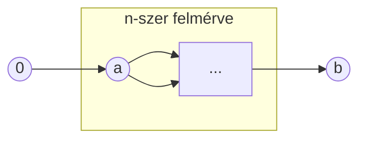

## 1. A teljes indukció elve.

**1. Tétel (A teljes indukció elve).** Tegyük fel, hogx minden $n$ természetes számra adott egy $A(n)$ állítás, és azt tudjuk, hogy

i) $A(0)$ igaz,

ii) ha $A(n)$ igaz, akkor $A(n+1)$ is igaz.

Ekkor az $A(n)$ állítás minden $n$ természetes számra igaz.

**Bizonyítás.** Legyen

$$
S := \left\lbrace n \in \mathbb{N} \mid A(n) \ \ \text{igaz}\right\rbrace.
$$

Ekkor $\underline{S \subset \mathbb{N}}$ és $S$ induktív halmaz, hiszen $0 \in S$, és ha $n \in S$, azaz $A(n)$ igaz, akkor $A(n+1)$ is igaz, ezért $n + 1 \in S$ teljesül következésképpen $S$ induktív halmaz. Mivel $\mathbb{N}$ a legszűkebb induktív halmaz, ezért az $\underline{\mathbb{N} \subset S}$ tartalmazás is fennáll, tehát $S=\mathbb{N}$. Ez pedig azt jelenti, hogy az állítás minden $n$ terészetes számra igaz.

## 2. A szuprémum elv.

**2. Tétel (A szuprérum elv).** Legyen $H \subset \mathbb{R}$ és tegyük fel, hogy 

i) $H \neq \emptyset$ és

ii) $H$ felülről korlátos.

Ekkor

$$
\exists \min \left\lbrace K \in \mathbb{R}\mid K \ \ \text{felső korlátja} \ \ H \text{-nak}\right\rbrace
$$

Legkisebb felső korlát.

**Bizonyítás.** Legyen

$$
A:=H \quad \text{és} \quad B:=\left\lbrace K \in \mathbb{R}\mid K \ \ \text{felső korlátja} \ \ H \text{-nak}\right\rbrace
$$

A feltételek miatt $A \neq \emptyset$ és $B \neq \emptyset$, továbbá

$$
\forall a \in A \quad \text{és} \quad \forall K \in B \quad \text{esetén} \quad a \leq K.
$$

Erre a $\xi$-re teljesül, hogy 

- $\xi$ felső korlátja $H$-nak, hiszen $a\leq \xi$ minden $a \in A$ esetén,
- $\xi$ a legkisebb felső korlát, ui. ha $K$ egy felső korlát (azaz $K \in B$), akkor $K \geq \xi$.

Ez pedig pontosan azt jelenti, hogy $\xi$ a $H$ halmaz legkisebb felső korlátja.

## 3. Az arkhimédészi tulajdonság.

**Az arkhimédészi tulajdonság**

Ha $n \in \mathbb{N}$, akkor egy szám $n$-szerese úgy tekinthető, mint a szám önmagával vett $n$-szeres összege. Ha $a >0$, akkor a számegyenesen ábrázolva látható, hogy az 

$$
n \cdot a = \underbrace{a + a + \dots + a}_{\text{n-szer}}
$$

alakú számok nagyon értékek vehetnek fel, amelyek bármely $b$ valós számnál is nagyobbak.

Ezt állítja az arkhimédészi tulajdonság.

**7. Tétel (Az arkhimédészi tulajdonság).** Minden $a>0$ és minden $b$ valós számhoz létezik olyan $n$ természetes szám, hogy $b<n \cdot a$, azaz

$$
\forall a > 0 \quad \text{és} \quad \forall b \in \mathbb{R} \quad \text{esetén} \quad \exists n \in \mathbb{N}, \quad \text{hogy} \quad b<n \cdot a.
$$

**Bizonyítás.** Indirekt módon. Tegyük fel, hogy

$$
\exists a > 0 \quad \text{és} \quad \exists b \in \mathbb{R}, \quad \text{hogy} \quad \forall n \in \mathbb{N} : b \geq n \cdot a.
$$

Legyen

$$
H := \left\lbrace n \cdot a \in \mathbb{R} \mid n \in \mathbb{N}\right\rbrace.
$$

Ekkor $H \neq \emptyset$ és $H$ felülről korlátos, hiszen $n \cdot a \leq b$ minden $n \in \mathbb{N}$-re. A szuprémum elv szerint

$$
\exists \sup H =: \xi.
$$

Ekkor $\xi$ a legkisebbb felső korlátja $H$-nak, tehát $\xi - a$ nem felső korlát. Ez azt jelenti, hogy 

$$
\exists n_0 \in \mathbb{N} : n_0 \cdot a > \xi - a \quad \iff \quad (n_0 + 1) \cdot a > \xi.
$$

Azonban $(n_0 + 1) \cdot a \in H$, tehát $(n_0 + 1) \cdot a \leq \xi$, hiszen \xi felső korlátja a $H$ halmaznak.

Így ellentmondáshoz jutottunk.

**Következmények.**

1. $\forall \epsilon > 0-hoz \exists n \in \mathbb{N}:\frac{1}{n}<\epsilon. \quad (\forall \epsilon > 0$-hoz $\exists n \in \mathbb{N} : 1 < n \cdot \epsilon)$

2. Az $\mathbb{N}$ halmaz felülről nem korlátos, $\quad (\forall b \in \mathbb{R}$-hez $\exists n \in \mathbb{N} : b < n \cdot 1 = n).$

Az intervallumokat a eddigi tanulmányainkban megszokott módon fogjuk értelmezni és jelölni.

Pl. ha $a,b \in \mathbb{R}$ és $a<b$, akkor az $a$ és $b$ számok által határolt zárt intervallum:

$$
\left[a,b\right] := \left\lbrace x \in \mathbb{R} \mid a \leq x \leq b \right\rbrace.
$$

## 4. A Cantor-tulajdonság.

## 5. Konvergens sorozatok határértékének egyértelműsége.

## 6. A konvergencia és a korlátosság kapcsolata.

## 7. Monoton részsorozatok létezésére vonatkozó tétel.

## 8. A sorozatokra vonatkozó közrefogási elv.

## 9. A határérték és a rendezés kapcsolata.

## 10. Műveletek nullsorozatokkal.

## 11. Konvergens sorozatok szorzatára vonatkozó tétel.

## 12. Konvergens sorozatok hányadosára vonatkozó tétel.

## 13. Monoton növekv® sorozatok határértékére vonatkozó tétel (véges és végtelen eset).

## 14. Az $a_n := \left(1 + \frac{1}{n}\right)^n \ \ (b \in \mathbb{N}^+)$ sorozat konvergenciája

## 15. Newton-féle iterációs eljárás $m$-edik gyökök keresésére.

## 16. A Cauchy-féle konvergenciakritérium sorozatokra.