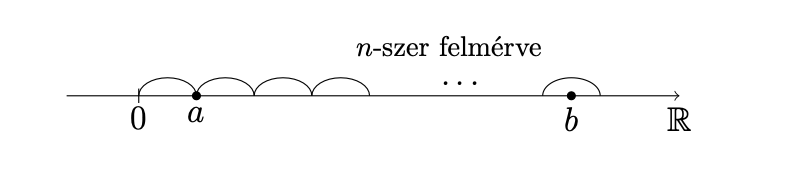

## 1. A teljes indukció elve.

**01/01 Tétel (A teljes indukció elve).** Tegyük fel, hogx minden $n$ természetes számra adott egy $A(n)$ állítás, és azt tudjuk, hogy

i) $A(0)$ igaz,

ii) ha $A(n)$ igaz, akkor $A(n+1)$ is igaz.

Ekkor az $A(n)$ állítás minden $n$ természetes számra igaz.

**Bizonyítás.** Legyen

$$
S := \left\lbrace n \in \mathbb{N} \mid A(n) \ \ \text{igaz}\right\rbrace.
$$

Ekkor $\underline{S \subset \mathbb{N}}$ és $S$ induktív halmaz, hiszen $0 \in S$, és ha $n \in S$, azaz $A(n)$ igaz, akkor $A(n+1)$ is igaz, ezért $n + 1 \in S$ teljesül következésképpen $S$ induktív halmaz. Mivel $\mathbb{N}$ a legszűkebb induktív halmaz, ezért az $\underline{\mathbb{N} \subset S}$ tartalmazás is fennáll, tehát $S=\mathbb{N}$. Ez pedig azt jelenti, hogy az állítás minden $n$ terészetes számra igaz.

## 2. A szuprémum elv.

**01/02 Tétel (A szuprérum elv).** Legyen $H \subset \mathbb{R}$ és tegyük fel, hogy 

i) $H \neq \emptyset$ és

ii) $H$ felülről korlátos.

Ekkor

$$
\exists \min \left\lbrace K \in \mathbb{R}\mid K \ \ \text{felső korlátja} \ \ H \text{-nak}\right\rbrace
$$

Legkisebb felső korlát.

**Bizonyítás.** Legyen

$$
A:=H \quad \text{és} \quad B:=\left\lbrace K \in \mathbb{R}\mid K \ \ \text{felső korlátja} \ \ H \text{-nak}\right\rbrace
$$

A feltételek miatt $A \neq \emptyset$ és $B \neq \emptyset$, továbbá

$$
\forall a \in A \quad \text{és} \quad \forall K \in B \quad \text{esetén} \quad a \leq K.
$$

Erre a $\xi$-re teljesül, hogy 

- $\xi$ felső korlátja $H$-nak, hiszen $a\leq \xi$ minden $a \in A$ esetén,
- $\xi$ a legkisebb felső korlát, ui. ha $K$ egy felső korlát (azaz $K \in B$), akkor $K \geq \xi$.

Ez pedig pontosan azt jelenti, hogy $\xi$ a $H$ halmaz legkisebb felső korlátja.

## 3. Az arkhimédészi tulajdonság.

**01/07 Tétel (Az arkhimédészi tulajdonság)**

Ha $n \in \mathbb{N}$, akkor egy szám $n$-szerese úgy tekinthető, mint a szám önmagával vett $n$-szeres összege. Ha $a >0$, akkor a számegyenesen ábrázolva látható, hogy az 

$$
n \cdot a = \underbrace{a + a + \dots + a}_{\text{n-szer}}
$$

alakú számok nagyon értékek vehetnek fel, amelyek bármely $b$ valós számnál is nagyobbak.

Ezt állítja az arkhimédészi tulajdonság.

**7. Tétel (Az arkhimédészi tulajdonság).** Minden $a>0$ és minden $b$ valós számhoz létezik olyan $n$ természetes szám, hogy $b<n \cdot a$, azaz

$$
\forall a > 0 \quad \text{és} \quad \forall b \in \mathbb{R} \quad \text{esetén} \quad \exists n \in \mathbb{N}, \quad \text{hogy} \quad b<n \cdot a.
$$

**Bizonyítás.** Indirekt módon. Tegyük fel, hogy

$$
\exists a > 0 \quad \text{és} \quad \exists b \in \mathbb{R}, \quad \text{hogy} \quad \forall n \in \mathbb{N} : b \geq n \cdot a.
$$

Legyen

$$
H := \left\lbrace n \cdot a \in \mathbb{R} \mid n \in \mathbb{N}\right\rbrace.
$$

Ekkor $H \neq \emptyset$ és $H$ felülről korlátos, hiszen $n \cdot a \leq b$ minden $n \in \mathbb{N}$-re. A szuprémum elv szerint

$$
\exists \sup H =: \xi.
$$

Ekkor $\xi$ a legkisebbb felső korlátja $H$-nak, tehát $\xi - a$ nem felső korlát. Ez azt jelenti, hogy 

$$
\exists n_0 \in \mathbb{N} : n_0 \cdot a > \xi - a \quad \iff \quad (n_0 + 1) \cdot a > \xi.
$$

Azonban $(n_0 + 1) \cdot a \in H$, tehát $(n_0 + 1) \cdot a \leq \xi$, hiszen \xi felső korlátja a $H$ halmaznak.

Így ellentmondáshoz jutottunk.

**Következmények.**

1. $\forall \epsilon > 0-hoz \exists n \in \mathbb{N}:\frac{1}{n}<\epsilon. \quad (\forall \epsilon > 0$-hoz $\exists n \in \mathbb{N} : 1 < n \cdot \epsilon)$

2. Az $\mathbb{N}$ halmaz felülről nem korlátos, $\quad (\forall b \in \mathbb{R}$-hez $\exists n \in \mathbb{N} : b < n \cdot 1 = n).$

Az intervallumokat a eddigi tanulmányainkban megszokott módon fogjuk értelmezni és jelölni.

Pl. ha $a,b \in \mathbb{R}$ és $a<b$, akkor az $a$ és $b$ számok által határolt zárt intervallum:

$$
\left[a,b\right] := \left\lbrace x \in \mathbb{R} \mid a \leq x \leq b \right\rbrace.
$$

## 4. A Cantor-tulajdonság.

A következő, ún. Cantor-tulajdonságot úgy szoktuk szavakba foglalni, hogy **egymásba skatulyázott korlátos és zárt intervallumok közös része nem üres.** Ezt szemlélteti az alábbi ábra:

**01/08 Tétel (A Cantor-tulajdonság).** Tegyük fel, hogy minden $n$ természetes számra adott az $[a_n, b_n] \subset \mathbb{R}$ korlátos és zárt intervallum úgy, hogy

$$
[a_{n+1}, b_{n+1}] \subset [a_n, b_n] \quad (n \in \mathbb{N}).
$$

Ekkor

$$
\bigcap_{n \in \mathbb{N}} [a_n, b_n] \neq \emptyset.
$$

**Bizonyítás.** A teljességi axiómát fogjuk alkalmazni. Legyen

$$
A := \left\lbrace a_n \mid n \in \mathbb{N} \right\rbrace \quad \text{és} \quad B := \left\lbrace b_n \mid n \in \mathbb{N} \right\rbrace .
$$

Először belátjuk, hogy

$(*) \quad \quad \quad a_n \leq b_m$ tetszőleges $n,m \in \mathbb{N}$ esetén.

Valóban,

i) ha $n \leq m$, akkor $a_n \leq a_m \leq b_m$,

ii) ha $m < n$, akkor $a_n \leq b_n \leq b_m$.

Mivel $A \neq \emptyset$ és $B \neq \emptyset$, ezért $(*)$ miatt a teljességi axióma feltételei teljesülnek, így 

$$
\exists \xi \in \mathbb{R} : a_n \leq \xi \leq b_m \quad \forall n,m \in \mathbb{N} \ \ \text{indexre}.
$$

Ha $n = m$, akkor azt kapjuk, hogy

$$
a_n \leq \xi \leq b_n \quad \iff \quad \xi \in [a_n,b_n] \ \ \forall n \in \mathbb{N} \ \ \text{esetén},
$$

és ez azt jelenti, hogy

$$
\xi \in \bigcap_{n \in \mathbb{N}} [a_n,b_n] \neq \emptyset.
$$

## 5. Konvergens sorozatok határértékének egyértelműsége.

**03/01 Tétel (A határérték egyértelműsége).** Ha az $(a_n) : \mathbb{N} \to \mathbb{R}$ sorozat konvergens, akkor a konvergencia definíciójában szereplő $A$ szám egyértelműen létezik.

$(*) \quad \exists A \ \mathbb{R}$, hogy $\forall \epsilon > 0 $ számhoz $\exists n_0 \in \mathbb{N}$, hogy $\forall n > n_0$ indexre $| a_n - A | < \epsilon$.

**Bizonyítás.** Tegyük fel, hogy az $(a_n)$ sorozatra $(*)$ az $A_1$ és az $A_2$ számokkal is teljesül.

Indirekt módon tegyük fel azt is, hogy $A_1 \neq A_2$. Ekkor $\forall \epsilon > 0$ számhoz

$$
\exists n_1 \in \mathbb{N}, \forall n > n_1 : | a_n - A_1| < \epsilon, \ \ \text{és}
$$

$$
\exists n_2 \in \mathbb{N}, \forall n > n_2 : | a_n - A_2| < \epsilon.
$$

Válasszuk itt speciálisan az 

$$
\epsilon := \frac{|A_1 - A_2|}{2}
$$

(pozitív) számot. Az ennek megfelelő $n_1, n_2$ indexeket figyelembe véve legyen

$$
n_0 := \max \lbrace n_1, n_2 \rbrace.
$$

Ha $n \in \mathbb{N}$ és $n>n_0$, akkor nyilván $n> n_1$ és $n > n_2$ is fennáll, következésképpen

$$
|A_1 - A_2| = |(A_1-a_n) + (a_n - A_2)| \leq |a_n - A_1| + |a_n - A_2| < \epsilon + \epsilon = 2 \epsilon = |A_1 - A_2|,
$$

amiből (a nyilván nem igaz) $|A_1 - A_2| < |A_1 - A_2|$ következne. Ezért csak $A_1 = A_2$ lehet.

Az $|a_n - A|< \epsilon$ egyenlőtlemség azzal ekvivalens, hogy $A - \epsilon < a_n < A + \epsilon$, vagyus $a_n \in K_\epsilon (A)$, azaz $a_n$ eleme az $A$ középpontú $\epsilon$ sugarú környezetnek. Ezért

$$
\lim (a_n) = A \quad \quad \iff \quad \quad \forall \epsilon > 0 \text{-hoz} \ \ \exists n_0 \in \mathbb{N}, \forall n > n_0 : a_n \in K_\epsilon (A).
$$

Szavakkal megfogalmazva azt is mondhatjuk, hogy "az $(a_n)$ sorozat konvergens, ha van olyan valós szám, hogy annak tetszőleges környezete tartalmazza a sorozat minden, alkalmas küszöbindex utáni tagját". Mivel a küszöbindex előtt csak véges sok index van, ezért

$$
\lim (a_n) = A \quad \quad \iff \quad \quad \forall \epsilon > 0 \ \ \text{esetén} \ \ \left\lbrace n \in \mathbb{N} \mid a_n \notin K_\epsilon (A) \right\rbrace \ \ \text{véges halmaz.}
$$

Más szavakkal: "az $(a_n)$ sorozat konvergens, ha van olyan valós szám, hogy annak tetszőleges környezetéből legfeljebb véges sok sorozatbeli tag marad ki".

A hatáérték fogalmát szemléltetik az alábbi ábrák:

## 6. A konvergencia és a korlátosság kapcsolata.

**03/03 Tétel.** Ha az $(a_n)$ sorozat konvergens, akkor korlátos is.

**Bizonyítás.** Tegyük fel, hogy $(a_n)$ konvergens és $\lim (a_n) = a \in \mathbb{R}$. Válasszuk a konvergencia definíciója szerinti jelöléssel $\epsilon$-t 1-nek. Ehhez a hibakorláthoz

$$
\exists n_0 \in \mathbb{N}, \forall n > n_0 : |a_n - A| < 1.
$$

Így

$$
|a_n| = |(a_n - A) + A| \leq |a_n - A| + |A| < 1 + |A| \quad (n>n_0).
$$

Ha $n \leq n_0$, akkor

$$
|a_n| \leq \max \left\lbrace |a_0|, |a_1, \dots , |a_n0| \right\rbrace.
$$

Legyen

$$
K := \max \left\lbrace |a_0|, |a_1|, \dots , |a_n0|, 1+|A|\right\rbrace.
$$

Ekkor $|a_n| \leq K$ minden $n \in \mathbb{N}$ indexre, és ez azt jelenti, hogy az $(a_n)$ sorozat korlátos.

**Megjegyzés.** Az állítás megfordítása nem igaz. Például a $\big( (-1)^n \big)$ sorozat korlátos, de nem konvergens. A konvergenciának tehát a korlátosság szükséges, de nem elégséges feltétele.

## 7. Monoton részsorozatok létezésére vonatkozó tétel.

**03/06 Tétel.** Minden $a = (a_n)$ valós sorozatnak létezik monoton részsorozata, azaz létezik olyan $v = v_n$ indexsorozat, amellyel $a \circ v$ monoton növekedő vagy monoton csökkenő.

**Bizonyítás.**

Az állítás igazolásához bevezetjük egy sorozat csúcsának a fogalmát: Azt mondjuk, hogy $a_{n_0}$ az $(a_n)$ sorozat csúcsa (vagy csúcseleme), ha 

$$
\forall n \geq n_0 \quad \text{indexre} \quad a_n \leq a_{n_0}.
$$

Két eset lehetséges.

I. eset. A sorozatnak **végtelen** sok csúcsa van. Ez azt jelenti, hogy

$$
\exists v_0 \in \mathbb{N} : a_{v_0} \ \ \text{csúcselem, azaz} \ \ \forall n \geq v_0 : a_n \leq a_{v_0},
$$

$$
\exists v_1 > v_0 : a_{v_1} \ \ \text{csúcselem, azaz} \ \ \forall n \geq v_1 : a_n \leq a_{v_1} \ (\leq a_{v_0}),
$$

Ezek a lépések folytathatók, mert végtelen sok csúcselem van. Így olyan $v_0 < v_1 < v_2 < \dots$ indexsorozatot kapunk, amelyre

$$
a_{v_0} \geq a_{v_1} \geq a_{v_2} \geq \dots,
$$

ezért a csúcsok $(a_{v_n})$ sorozata $(a_n)$-nek egy monoton csökkenő részsorozata.

II. eset. A sorozatnak legfeljebb **véges** sok csúcsa van. Ez azt jelenti, hogy 

$$
\exists N \in \mathbb{N}, \forall n \geq N \quad \text{esetén} \quad a_n \quad \text{már nem csúcs}. 
$$

Mivel $a_N$ nem csúcselem, ezért

$$
\exists v_0 > N : a_{v_0} > a_N.
$$

Azonban $a_{v_0}$ sem csúcselem, ezért

$$
\exists v_1 > v_0 : a_{v_1} > a_{v_0} \ (> a_N).
$$

Az eljárást folytatva most olyan $v_0<v_1<v_2<\dots$ indexsorozatot kapunk, amelyre

$$
a_{v_0} < a_{v_1} < a_{v_2} < \dots .
$$

Ebben az esetben tehát $(a_{v_n})$ sorozat $(a_n)$-nek egy (szigorúan) monoton növekvő részsorozata.

## 8. A sorozatokra vonatkozó közrefogási elv.

**03/07 Tétel (A közrefogási elv).** Tegyük fel, hogy az $(a_n)$, $(b_n)$ és $(c_n)$ sorozatokra teljesülnek a következők:

- $\exists N \in \mathbb{N}, \forall n > N : a_n \leq b_n \leq c_n$,
- az $(a_n)$ és a $(c_n)$ sorozatnak van határértéke, továbbá

$$
\lim (a_n) = \lim (c_n) = A \in \overline{\mathbb{R}}.
$$

Ekkor a $(b_n)$ sorozatnak is van határértéke és $\lim (b_n) = A$.

**Bizonyítás.** Három eset lehetséges.

I. eset: $\boxed{A \in \mathbb{R}}$ Legyen $\epsilon > 0$ tetszőleges valós szám. $\lim (a_n) = \lim(c_n) = A$ azt jelenti, hogy $(a_n)$ és $(c_n)$ azonos $A$ határértékkel rendelkező konvergens sorozatok. A konvergencia definíciója szerint tehát

$$
\exists n_1 \in \mathbb{N}, \forall n > n_1 : A -\epsilon < a_n < A + \epsilon,
$$

$$
\exists n_2 \in \mathbb{N}, \forall n > n_2 : A -\epsilon < c_n < A + \epsilon,
$$

Legyen $n_0 := \max \left\lbrace N, n_1, n_2 \right\rbrace$. Ekkor $\forall n > n_0$ indexre

$$
A - \epsilon < a_n \leq b_n \leq c_n < A+\epsilon.
$$

Ez azt jelenti, hogy

$$
|b_n -A | < \epsilon , \quad \text{ha} \quad n > n_0,
$$

azaz a $(b_n)$ sorozat konvergens, tehát van határértéke, és $\lim (b_n) = A$.

II. eset: $\boxed{A = + \infty}$ Tegyük fel, hogy $P > 0$ tetszőleges valós szám. A $\lim (a_n) = + \infty$ értelmezése szerint

$$
\exists n_1 \in \mathbb{N}, \forall n > n_1 : a_n > P.
$$

Legyen $n_0 := \max \left\lbrace N,n_1 \right\rbrace$. Ekkor $\forall n > n_0$ indexre

$$
P < a_n \leq b_n,
$$

és ez azt jelenti, hogy $\lim(b_n) = + \infty$.

III. eset: $\boxed{A = - \infty}$ Tegyük fel, hogy P<0 tetszőleges valós szám. A $\lim (c_n) = - \infty$ értelmezése szerint

$$
\exists n_1 \in \mathbb{N}, \forall n > n_1 : c_n < P.
$$

Legyen $n_0 := \max \left\lbrace N, n_1 \right\rbrace$, akkor $\forall n > n_0$ indexre

$$
P > c_n \geq b_n.
$$

Ez pedig azt jelenti, hogy $\lim (b_n) = - \infty$.

**Megjegyzés.** Vegyük észre, hogy a bizonyítás 2. esetében a $(c_n)$ sorozat nem játszik szerepet.

Ezért ebben az esetben közrefogás helyett egy *minoráns* jellegű tulajdonságot kapunk:

$$
\exists N \in \mathbb{N}, \forall n > N : a_n \leq b_n \quad \text{és} \quad \lim(a_n) = + \infty \quad \implies \quad \lim (b_n) = + \infty.
$$

Hasonlóan, a bizonyítás 3. esetében az (a_n) sorozat nem játszik szerepet. Ezért ebben az esetben közrefogás helyett egy *majoráns* jellegű tulajdonságot kapunk:

$$
\exists N \in \mathbb{N}, \forall n > N : b_n \leq c_n \quad \text{és} \quad \lim (c_n) = - \infty \quad \implies \quad \lim (b_n) = - \infty.
$$

## 9. A határérték és a rendezés kapcsolata.

A következő tétel azt állítja, hogy a határértékek közötti nagyságrendi kapcsolatok öröklődnek a soroatok elég nagy indexű tagjaira. Sőt, bizonyos értelemben "fordítva": a tagok nagyságrendi kapcsolataiból következtethetünk a határértékek közötti nagyságrendi viszonyokra.

**03/08 Tétel.** Tegyük fel, hogy az $(a_n)$ és a $(b_n)$ sorozatnak van határértéke és

$$
\lim (a_n) = A \in \overline{\mathbb{R}}, \quad \quad \lim (b_n) = B \in \overline{\mathbb{R}}.
$$

Ekkor:

1. $A < B \quad \implies \quad \exists N \in \mathbb{N}, \forall n > N : a_n < b_n$.
2. $\exists N \in \mathbb{N}, \forall n > N : a_n \leq b_n \quad \implies \quad A \leq B.$

**Bizonyítás.**

I. Azt már tudjuk, hogy bármely két különböző $\overline{\mathbb{R}}$-beli elem szétválasztható diszjunkt környezetekkel:

$$
\forall A,B \in \overline{\mathbb{R}}, A \neq B \text{-hez} \ \ \exists r_1,r_2 > 0, K_{r_1}(A) \cap K_{r_2}(B) = \emptyset.
$$

Világos, hogy ha $A < B$, akor $\forall x \in K_{r_1}(A), \forall y \in K_{r_2}(B):x<y$.

Mivel $\lim (a_n) = A$ és $\lim (b_n) = B$, így a definíció értelmében

$$
\exists n_1 \in \mathbb{N}, \forall n > n_1 : a_n \in K_{r_1}(A),
$$

$$
\exists n_2 \in \mathbb{N}, \forall n > n_2 : b_n \in K_{r_1}(B).
$$

Legyen $N := \max \left\lbrace n_1, n_2 \right\rbrace$. Ekkor $\forall n > N$ esetén

$$
a_n \in K_{r_1}(A) \quad \text{és} \quad b_n \in K_{r_2}(B) \quad \implies \quad a_n<b_n.
$$

II. Indirekt módon bizonyítjuk. Tegyük fel, hogy $A>B$. Ekkor a már igazolt 1. állítás szerint $\exists N \in \mathbb{N}$, hogy minden $n > N$ indexre $b_n < a_n$, ami ellentmond a feltételnek.

**Megjegyzés.** Figyeljük meg, hogy tétel állításai "majdnem" egymás megfordításai, de egyik sem fordítható meg.

- Az 1. állítás megfordítása nem igaz, azaz az $a_n < b_n$ feltételből nem következtethetünk az $A<B$ egyenlőtlenségre. Tekintsük oéldául az 

$$
a_n := - \frac{1}{n} \quad \text{és} \quad b_n := \frac{1}{n} \quad (n \in \mathbb{N}^+)
$$

sorozatokat.

- A 2. állítás megfordítása sem igaz. Legyen például

$$
a_n := \frac{1}{n} \quad \text{és} \quad b_n := - \frac{1}{n} \quad (n \in \mathbb{N}^+).
$$

## 10. Műveletek nullsorozatokkal.

**04/02 Tétel (Műveletek nullsorozatokkal).** Tegyük fel, hogy $\lim (a_n) = 0$ és $\lim (b_n) = 0$.

Ekkor

1. $(a_n + b_n)$ is nullsorozat,
2. ha $(c_n)$ korlátos sorozat, akkor $(c_n \cdot a_n)$ is nullsorozat,
3. $(a_n \cdot b_n)$ is nullsorozat.

**Bizonyítás.**

1. Mivel $\lim (a_n) = \lim (b_n) = 0$, ezért $\forall \epsilon > 0$-hoz

$$
\exists n_1 \in \mathbb{N}, \forall n > n_1 : | a_n | < \frac{\epsilon}{2},
$$

$$
\exists n_2 \in \mathbb{N}, \forall n > n_2 : | b_n | < \frac{\epsilon}{2}.
$$

Legyen $n_0 := \max \left\lbrace n_1, n_2 \right\rbrace$. Ekkor $\forall n > n_0$ indexre

$$
|a_n + b_n| \leq |a_n| + |b_n| < \frac{\epsilon}{2} + \frac{\epsilon}{2} = \epsilon,
$$

és ez azt jelenti, hogy $\lim (a_n + b_n) = 0$, azaz $(a_n + b_n)$ valóban nullsorozat.

2. A $(c_n)$ sorozat korlátos, ezért

$$
\exists K > 0 : |c_n| < K \quad (n \in \mathbb{N}).
$$

Mivel $(a_n)$ nullsorozat, ezért

$$
\forall \epsilon > 0 \text{-hoz} \ \ \exists n_0 \in \mathbb{N}, \forall n > n_0 : |a_n| < \frac{\epsilon}{K},
$$

következésképpen minden $n > n_0$ indexre

$$
|c_n \cdot a_n| = |c_n| \cdot |a_n| < K \cdot \frac{\epsilon}{K} = \epsilon ,
$$

azaz $\lim (c_n \cdot a_n) = 0$.

3. Mivel minden konvergens sorozat korlátos, ezért a $\lim (b_n) = 0$ feltételből következik, hogy $(b_n)$ korlátos sorozat. Az állítás tehát a 2. állítás közvetlen következménye.

## 11. Konvergens sorozatok szorzatára vonatkozó tétel.

## 12. Konvergens sorozatok hányadosára vonatkozó tétel.

A következő tétel már általános kovergens sorozatokra vonatkozik. Azt állítja, hogy a konvergens sorozatok a müveletek során a legtöbb esetben jól viselkednek abban az értelemben, hgy az alapműveletek és a határértékképzés sorrendje felcserélhető.

**04/03 Tétel (Műveletek konvergens sorozatokkal).** Tegyük fel, hogy az $(a_n)$ és a $(b_n)$ sorozat konvergens. Legyen

$$
\lim (a_n) = A \in \mathbb{R} \quad \text{és} \quad \lim (b_n) B \in \mathbb{R}. 
$$

Ekkor

1. $(a_n + b_n)$ is konvergens és $\lim (a_n + b_n) = \lim (a_n) + \lim (b_n) = A + B$,
2. $(a_n \cdot b_n)$ is konvergens és $\lim (a_n \cdot b_n) = \lim (a_n) \cdot \lim (b_n) = A \cdot B$,
3. ha $b_n \neq 0 \ \ (n \in \mathbb{N})$ és $\lim (b_n) \neq 0$, akkor

$$
\left(\frac{a_n}{b_n}\right) \quad \text{is konvergens, és} \ \ \lim \left(\frac{a_n}{b_n}\right) = \frac{\lim (a_n)}{\lim (b_n)} = \frac{A}{B}.
$$

**Bizonyítás.** Gyakran fogjuk alkalmazni a nullsorozatok 2. alaptulajdonsága, ami azt mondja ki, hogy

$(*) \quad (x_n)$ konvergens, és $\alpha \in \mathbb{R}$ a  határértéke $\quad \iff \quad (x_n - \alpha)$ nullsorozat.

1. $(*)$ miatt elég megmutatni, hogy $\big((a_n + b_n) - (A + B)\big)$ nullsorozat. Ez nyilván igaz, mert

$$
\big((a_n + b_n) - (A + B)\big) = (a_n - A) + (b_n - B),
$$

és két nullsorozat összege is nullsorozat.

2. $(*)$ miatt elég megmutatni, hogy (a_n b_n - AB) nullsorozat. Ez a következő átalakítással igazolható:

$$
a_n b_n - AB = a_n b_n - A b_n + A b_n -AB = \underbrace{\underbrace{\underbrace{b_n}_{\text{korlátos}} \cdot \underbrace{(a_n - A)}_{\text{nullsorozat}}}_{\text{nullsorozat}} +\underbrace{\underbrace{A}_{\text{korlátos}} \cdot \underbrace{(b_n - B)}_{\text{nullsorozat}}}_{\text{nullsorozat}}}_{\text{nullsorozat}}.
$$

$$
\underbrace{b_n}_{nullsorozat}
$$

$$
a_n b_n - AB = a_n b_n - A b_n + A b_n -AB = \underbrace{\underbrace{\underbrace{b_n}_{korlátos} \cdot \underbrace{(a_n - A)}_{nullsorozat}}_{nullsorozat} +\underbrace{\underbrace{A}_{korlátos} \cdot \underbrace{(b_n - B)}_{nullsorozat}}_{nullsorozat}}_{nullsorozat}.
$$

A fenti gondolatmenetben a $(b_n)$ sorozat azért korlátos, mert konvergens.

3. A bizonyításhoz először egy önmagában is érdekes állítást igazolunk.

**$\underline{\text{Segédtétel.}}$** Ha $b_n \neq 0 \ \ (n\in \mathbb{N})$ és $(b_n)$ konvergens, továbbá $B := \lim (b_n) \neq 0$, akkor az

$$
\left(\frac{1}{b_n} \right)
$$

reciprok-sorozat korlátos.

Ennek bizonyításához legyen $\epsilon := |B|/2$. Ekkor egy alkalmas $n_0 \in \mathbb{N}$ küszöbindex mellett

$$
|b_n - B| < \epsilon = \frac{|B|}{2} \quad \forall n > n_0 \ \ \text{indexre}.
$$

Így minden $n > n_0$ esetén

$$
|b_n| \geq |B| - |b_n -B| > |B| - \frac{|B|}{2} = \frac{|B|}{2},
$$

hiszen $|B| = |B - b_n + b_n| \leq |B - b_n| + |b_n|$. Tehát

$$
\left| \frac{1}{b_n} \right| < \frac{2}{|B|}, \ \ \text{ha} \ \ n>n_0,
$$

következésképpen az 

$$
\left| \frac{1}{b_n} \right| \leq \max \left\lbrace \frac{1}{|b_0|}, \frac{1}{|b_1|}, \dots , \frac{1}{|b_{n_0}|}, \frac{2}{|B|} \right\rbrace
$$

egyenlőtlenség már minden $n \in \mathbb{N}$ számra teljesül, ezért az $(1/b_n)$ sorozat valóban korlátos. A segédtételt tehát bebizonyíítottuk.

Most azt látjuk be, hogy az 

$$
\left(\frac{1}{b_n} \right) \ \ \text{sorozat konvergens} \quad \text{és} \quad \lim \left(\frac{1}{b_n}\right) = \frac{1}{B}.
$$

Ez $(*)$-ből következik az alábbi átalakítással:

$$
\frac{1}{b_n} - \frac{1}{B} = \frac{B - b_n}{B \cdot b_n} = \underbrace{\underbrace{\frac{1}{B \cdot b_n}}_{\text{korlátos}} \cdot \underbrace{(B - b_n)}_{\text{nullsorozat}}}_{\text{nullsorozat}}.
$$

A 3. állítás bizonyításának a befejezéséhez már csal azt kell figyelembe venni, hogy

$$
\frac{a_n}{b_n} = a_n \cdot \frac{1}{b_n} \quad (n \in \mathbb{N}),
$$

más szóval az $(a_n/b_n)$ "hányados-sorozat" két konvergens sorozat szorzata. Így a 2. állítás és a reciprok sorozatról az előbb mondottak miatt

$$
\left(\frac{a_n}{b_n} \right) \ \ \text{is konvergens} \ \ \text{és} \ \ \lim \left(\frac{a_n}{b_n} \right) = A \cdot \frac{1}{B} = \frac{A}{B} = \frac{\lim (a_n)}{\lim (b_n)}.
$$

## 13. Monoton növekvő sorozatok határértékére vonatkozó tétel (véges és végtelen eset).

## 14. Az $a_n := \left(1 + \frac{1}{n}\right)^n \ \ (b \in \mathbb{N}^+)$ sorozat konvergenciája

## 15. Newton-féle iterációs eljárás $m$-edik gyökök keresésére.

## 16. A Cauchy-féle konvergenciakritérium sorozatokra.